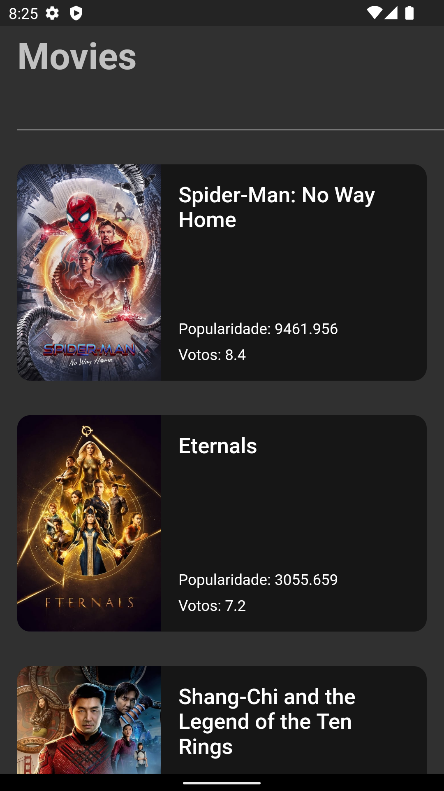
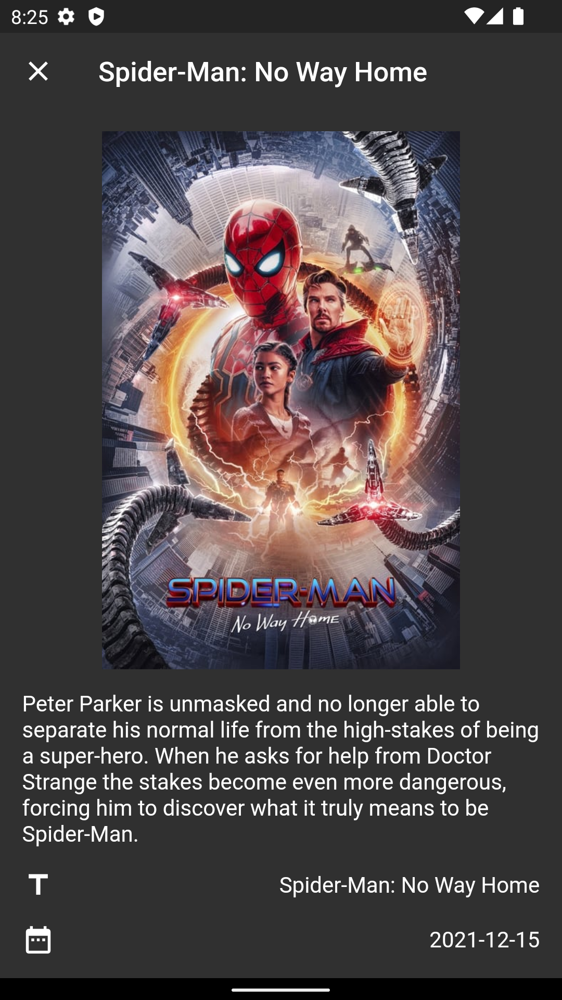

# Movies App

  
  

 

## 💻 Project

An application that aims to study Flutter and Dart

## 🚀 Packages

This project was developed with the following packages:

- [Flutter](https://flutter.dev/)
- [dio](https://pub.dev/packages/dio)
- [lottie](https://pub.dev/packages/lottie)
- [cached_network_image](https://pub.dev/packages/cached_network_image)
- [shared_preferences](https://pub.dev/packages/shared_preferences)

## 📄 License

This project is under the MIT license.